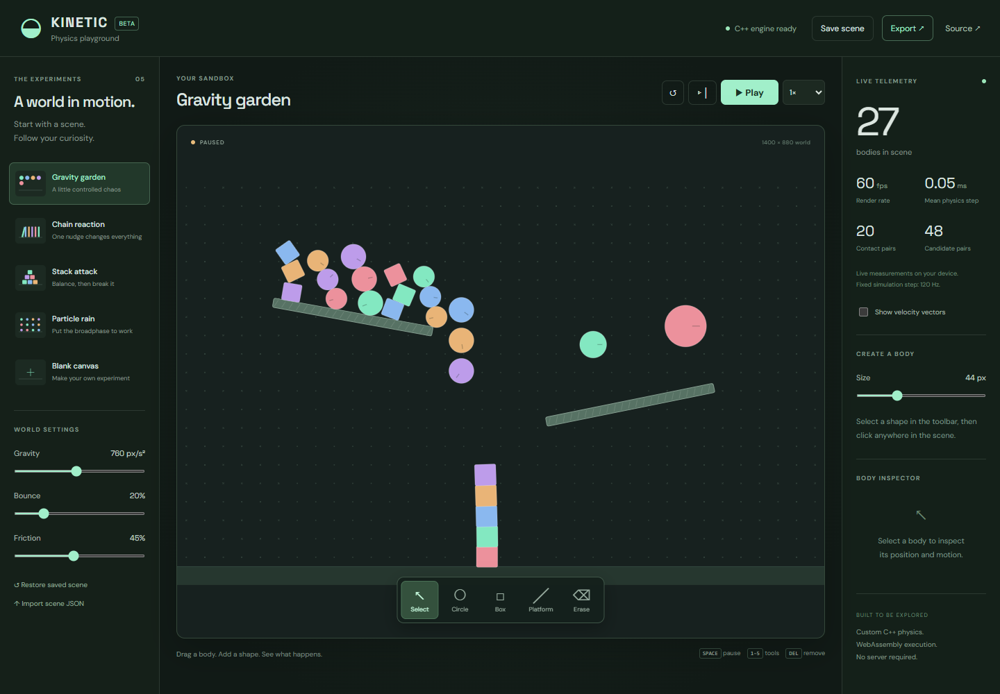

# Kinetic — an interactive physics playground

A browser sandbox for building little worlds and watching them move. Add circles and boxes, tip a row of dominoes, change gravity, or inspect a collision one simulation step at a time.

**Working beta · C++20 → WebAssembly · TypeScript / React · No backend**



## Try it in two minutes

Requires Node.js 22.12+ (tested with Node 24). The compiled engine is checked in, so trying the app does not require a C++ toolchain.

```sh
git clone https://github.com/A-Mardi/physics-playground.git
cd physics-playground
npm ci --prefix web
npm run dev --prefix web
```

Open **http://127.0.0.1:5175**. Choose **Chain reaction**, pause, and advance a step. Switch to **Blank canvas** to build your own experiment.

## What works

- Five starting scenes, including a 160-body rain scene.
- Circle and rotated-box collisions, static platforms, angular motion, friction, and adjustable restitution.
- Select, drag, rotate, create, and delete bodies; pause, single-step, and change playback speed.
- Live render rate, physics-step time, contact count, and broadphase candidate count.
- Local scene persistence and validated JSON import/export, including body velocities.
- Responsive controls and keyboard shortcuts: **Space** pauses, **1–5** selects a tool, **Delete** removes a selected body.

The interface uses three base colors: warm off-white, charcoal, and sage. Choose a scene from the top dropdown and use the bottom toolbar to create shapes or control playback. **Settings** contains world controls, the selected-body inspector, and expandable performance details. The **•••** menu contains save, restore, import, and export actions. Both menus work on mobile and dismiss with Escape or a click outside.

## Engineering

The engine is implemented in C++, rather than wrapping a physics library. A uniform grid produces candidate pairs; circle tests and oriented-box separating-axis tests generate contacts. An iterative impulse solver includes angular inertia and Coulomb-style friction.

The TypeScript client reads a packed float buffer from WebAssembly memory. Physics advances at a fixed **120 Hz**, independently of rendering. Catch-up work is capped to keep an overloaded tab responsive.

Canvas 2D renders the scene; React handles controls and periodically sampled telemetry. No Three.js, account, server, or runtime network service is needed. Fonts are bundled locally.

Read the [architecture and tradeoffs](docs/ARCHITECTURE.md) and [benchmark methodology](docs/BENCHMARKS.md).

## Build and verify

```sh
npm run build --prefix web
node scripts/test-engine.mjs
cd web
npx playwright install chromium
npm test
```

The engine test executes the actual shipped WASM module in Node. Browser tests exercise creation, persistence, export, invalid imports, and a gravity-restoration regression.

To rebuild the engine, install and activate **Emscripten 6.0.10**, then run from the repository root:

```sh
node scripts/build-engine.mjs
node scripts/test-engine.mjs
```

Set `EMSDK` to your SDK directory if it is not already exported. `EMSDK_PYTHON` and `EMXX` can override executable paths. Commit regenerated `web/public/engine/physics.js` and `physics.wasm` alongside engine changes.

Native checks with CMake and a C++20 compiler:

```sh
cmake -S core -B core/build -DCMAKE_BUILD_TYPE=Release
cmake --build core/build --config Release
ctest --test-dir core/build -C Release --output-on-failure
```

CI rebuilds the WASM module from source, tests it, compiles the native engine, and runs browser tests.

## Beta boundaries

This is an educational rigid-body sandbox, not a scientific simulator. It supports up to **508 user bodies** in a bounded world. Collision detection is discrete: fast, small bodies can tunnel. Dense stacks can jitter, and the contact manifold is approximate. There are no joints, continuous collision detection, sleeping bodies, or undo history yet. Dragging directly repositions bodies.

Saving is local to the current browser and origin; export JSON for a portable copy. No performance number is a guarantee for every device.

[MIT license](LICENSE) · [Contributing](CONTRIBUTING.md) · [Next steps](docs/ROADMAP.md)

### Undo and redo

Undo/redo keeps up to 50 scene-edit checkpoints in this tab: creation, deletion, dragging, rotation, environment edits, preset/reset/import, and manual steps. It restores body positions and velocities as well as gravity and material settings, then pauses the scene. Use the toolbar or Ctrl/Command+Z and Ctrl/Command+Shift+Z (Ctrl+Y also works). New edits discard the redo branch. Continuous simulation frames are not recorded; history is not saved across reloads.
